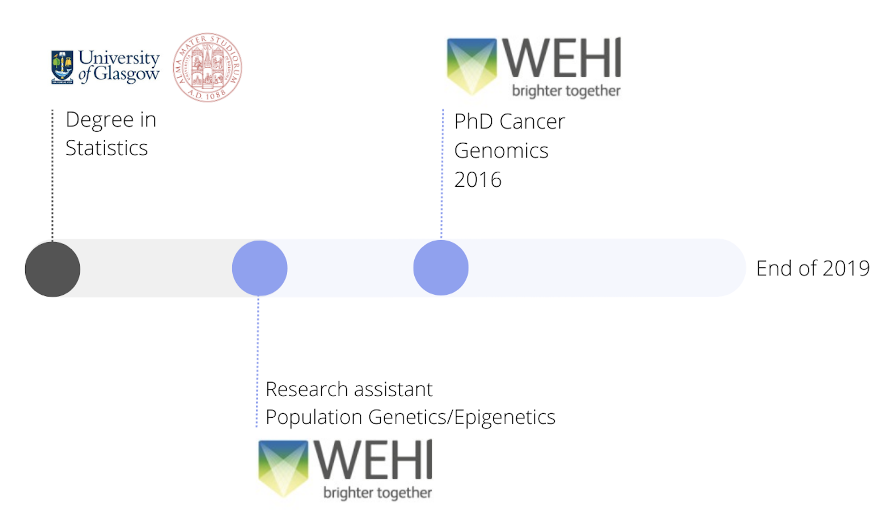
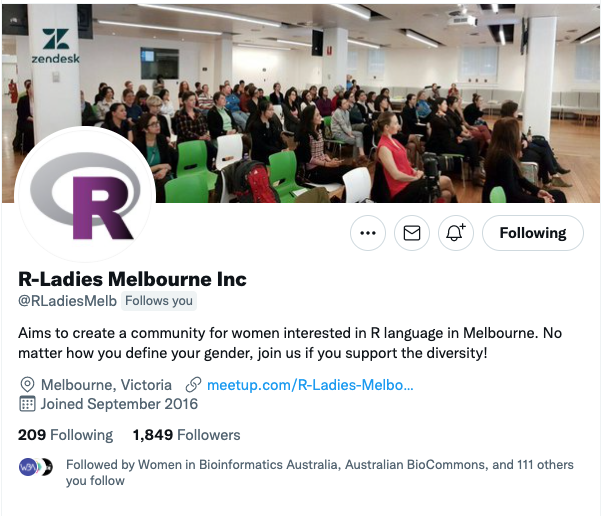
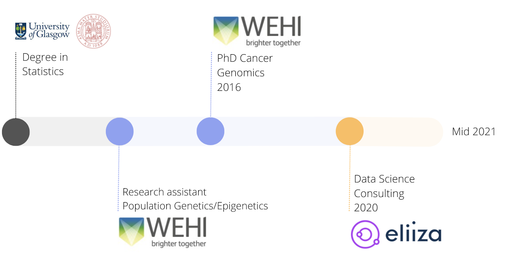
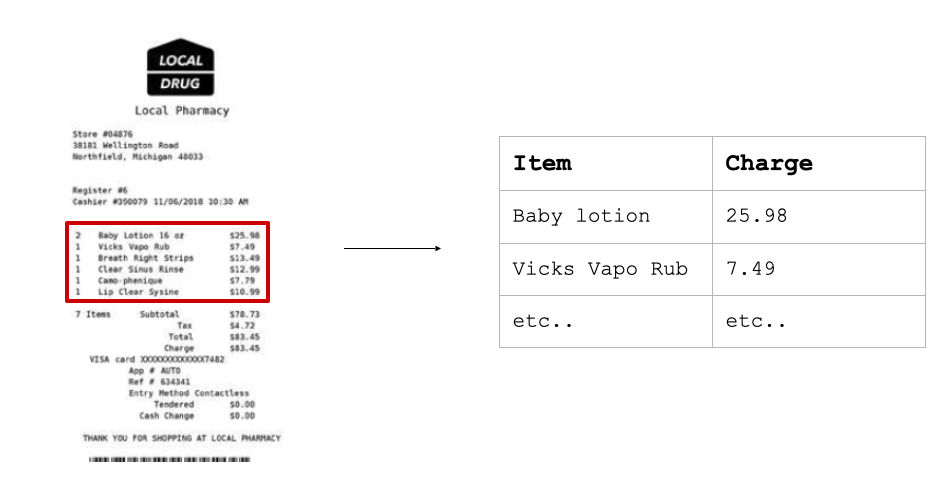
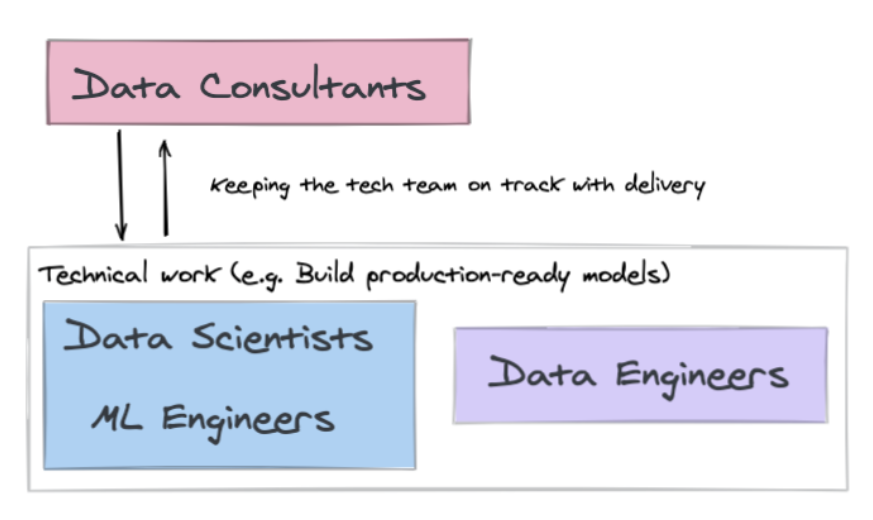
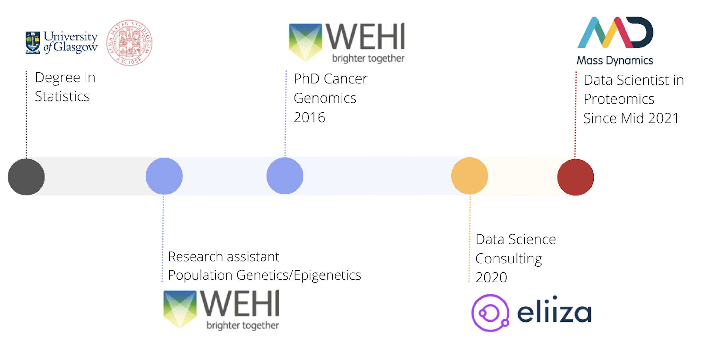
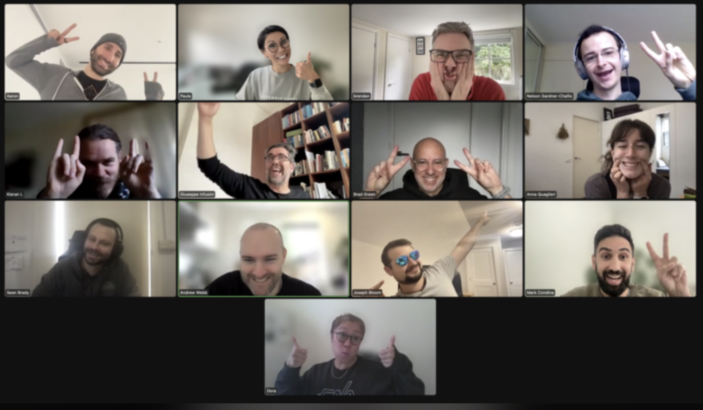
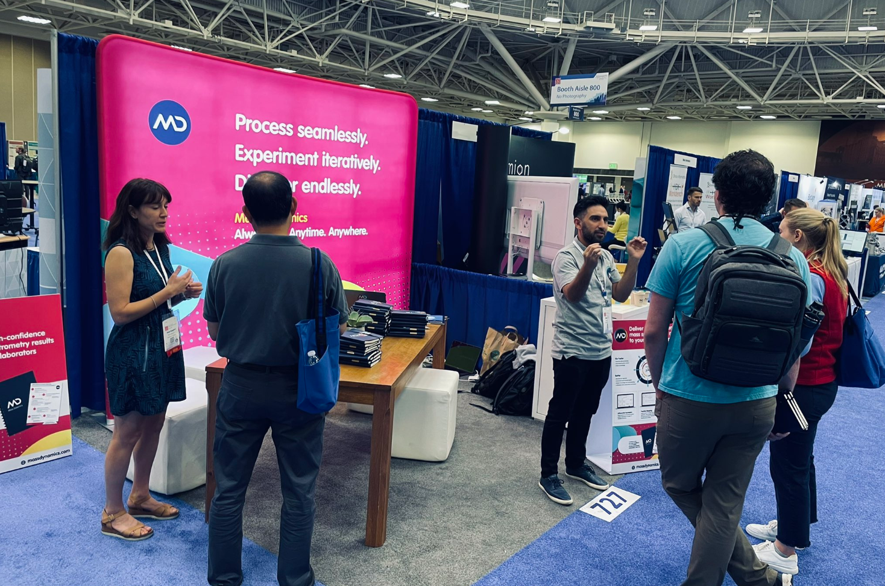
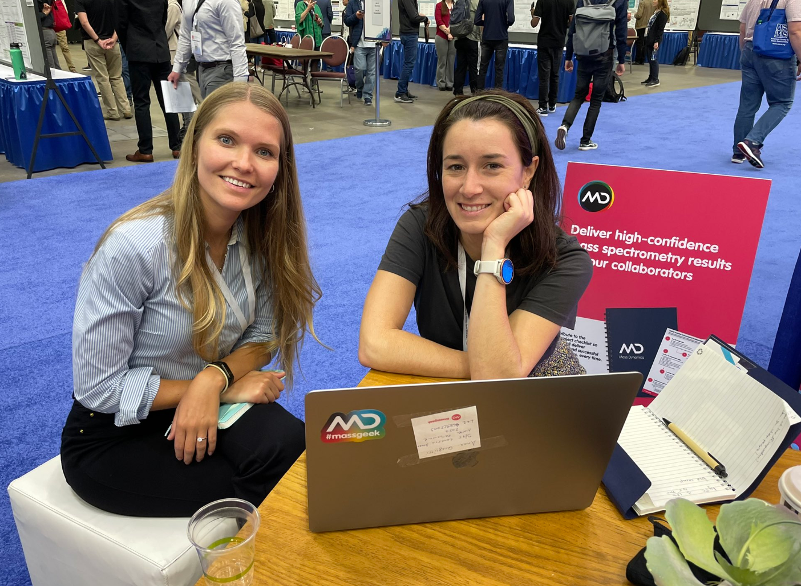
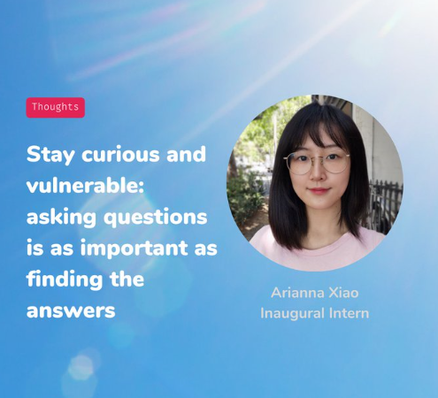

---
output:
  xaringan::moon_reader:
    seal: false
    css: xaringan-themer.css
    nature:
      slideNumberFormat: "%current%"
      highlightStyle: github
      highlightLines: true
      ratio: 16:9
      countIncrementalSlides: true
---

class: center, middle, inverse
background-size: contain

# My journey in data science


.large[Anna Quaglieri]

.medium[SSA Victoria - Early Career Panel |21 September 2022]


```{r setup, include=FALSE}
options(htmltools.dir.version = FALSE)
knitr::opts_chunk$set(
  fig.width=9, fig.height=3.5, fig.retina=3,
  out.width = "100%",
  cache = FALSE,
  echo = TRUE,
  message = FALSE, 
  warning = FALSE,
  hiline = TRUE
)
```

```{r xaringan-themer, include=FALSE, warning=FALSE}
# devtools::install_github("gadenbuie/xaringanExtra")

library(xaringanExtra)
library(xaringan)
library(xaringanthemer)
library(fontawesome)

# #7b8e1f
style_duo_accent(
  primary_color = "#424240",
  secondary_color = "#ffffff",
  inverse_header_color = "#290502", 
  link_color = "darkmagenta",
  code_highlight_color = "#add8e6", 
  footnote_color = "black", 
  footnote_position_bottom = "40px", 
  footnote_font_size = "0.7em"
)
```

---
name: intro

## Academic training in Statistics & Bioinformatics


.left[]


---
name: intro

## Organiser of R-Ladies Melbourne since 2016

.center[]

---

## Then...

Towards the end of my PhD:

I was curious about what other alternatives career I could do with my skills

---

## Data Science consulting at Eliiza

.left[]


---

background-image: url(figures1/eliiza-logo.png)
background-position: 100% 0%
background-size: 20%


## Data Science consulting at Eliiza

--

**Machine learning** in action & in production in a completely new field. 

.pull-left[

Claim processing for an insurance company

]


.pull-right[


]


.footnote[- Nib adopts machine learning for claims processing: https://www.itnews.com.au/news/nib-adopts-machine-learning-for-claims-processing-555752 (2020)
- My talk at Virtual Brown Bag by Eliiza: Automating data extraction from documents: https://www.youtube.com/watch?v=pBJoYr_oLEI&ab_channel=Eliiza]

---

background-image: url(figures1/eliiza-logo.png)
background-position: 100% 0%
background-size: 20%


## Data Science consulting at Eliiza


**Machine learning** in action & in production in a completely new field.

**Working as a team**: I was never only by myself on a project - we needed to deliver a solution as a team, usually Data Scientist + ML Engineer


.center[]

---

background-image: url(figures1/eliiza-logo.png)
background-position: 100% 0%
background-size: 20%


## Data Science consulting at Eliiza

**Machine learning** in action & in production in a completely new field.

**Working as a team**: I was never only by myself on a project - we needed to deliver a solution as a team, usually Data Scientist + ML Engineer

**Project management in consulting**: The work is planned from the beginning in a very structured way: with clear goals, actions and metrics

---

background-image: url(figures1/eliiza-logo.png)
background-position: 100% 0%
background-size: 20%


## Data Science consulting at Eliiza

**Machine learning** in action & in production in a completely new field.

**Working as a team**: I was never only by myself on a project - we needed to deliver a solution as a team, usually Data Scientist + ML Engineer.

**Project management in consulting**: The work is planned from the beginning in a very structured way: with clear goals, actions and metrics.

**Took part in hiring**: Review applications, lead data science technical interviews.


---

## But then..

I was missing working in science...

---
class: center

## Bioinformatics Data Scientist at Mass Dynamics


.center[

> Mass Dynamics enables life scientists to transform complex and quantitative scientific data to knowledge - better, faster, easier and without compromise.

]

.center[]

---
background-image: url(figures1/md-center.png)
background-position: 100% 0%
background-size: 20%

## What I do day to day  

🏡💻 **Work in a fun multidisplinary team**: Work with a fun interdisciplinary team of scientists, developers, marketing, designers experts.

.center[
]

---
background-image: url(figures1/md-center.png)
background-position: 100% 0%
background-size: 20%

## What I do day to day  

🏡💻 **Work in a fun multidisplinary team**: Work with a fun interdisciplinary team of scientists, developers, marketing, designers experts.


📙 **Learn and remain up to date with mass spectrometry data processing**: conferences, reading papers, talking to our in-house mass spec experts.   

.pull-left[


]


.pull-right[


]

---
background-image: url(figures1/md-center.png)
background-position: 100% 0%
background-size: 20%

## What I do day to day  

🏡💻 **Work in a fun multidisplinary team**: Work with a fun interdisciplinary team of scientists, developers, marketing, designers experts.


📙 **Learn and remain up to date with mass spectrometry data processing**: conferences, reading papers, talking to our in-house mass spec experts.   


💻 **Method and sofwtare development**: workflows (usually R/Python) to pre-process, analyse, visualise, interpret mass spectrometry data.   

1. Research and plan 
1. Quick prototype to test new functionalities, usually with R Shiny
2. Implement and integrate in platform

--

👐 **Consulting**: e.g. when users needs some help with our platform features or have features request.

--

**BAU**: fix bugs; general sofware maintainance. 


---
background-image: url(figures1/md-center.png)
background-position: 100% 0%
background-size: 20%

## "Being the inauguaral intern at a start-up"

📙 Suggest reading blogpost from our first intern Arianna last summer https://bit.ly/AXBlog_1

.center[
]


---
name: whatme

## Some general reflections

--

- **Changing plans is fine**

  - My pre-pandemic plans were very different to what actually happened but it still turned out ok for me
  - Opportunities might arise and you’re not ready or viceversa and that’s normal 

--

- **Deep focus or broader knowledge**: Understanding which fits best for you can really help

--

- **Being part of a community** (R-Ladies Melbourne, Fems) really helped to make meaningful connections & support network, especially if you're trying to enter into a new field 

--

- **Look for opportunities to stand out**: online presence; giving talks; volunteers at groups of interest; social media presence  

--

- Meet and network with people when not in person:
  - Reach out and connect with someone after you’ve met them at an event 
  - A few people reached out during over the lockdowns to ask for career advice or general suggestions
  - I was told from a mentor: "People love to be asked for help!"


---

## Acknowledgement

These slides were created using the `{xaringan}` 📦 by Yihui Xie (2021). xaringan: Presentation Ninja. R package version 0.22. https://CRAN.R-project.org/package=xaringan 


## Any question?

You can fine me at:

- [`r fa(name = "twitter")` @annaquagli](https://twitter.com/annaquagli)
- [`r fa(name = "github")` @annaquaglieri16](https://github.com/annaquaglieri16) 